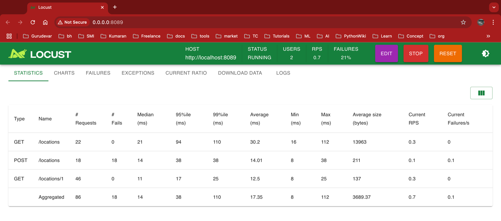

# store_locator API
   ```text
    A Python API for querying store_locator delivery locations based on user geolocation. 
    The API uses PostgreSQL with PostGIS for geospatial queries and Redis for caching.
   ```

## Features
- API implementation with FastAPI REST framework
- PostgreSQL with PostGIS for geospatial queries
- Redis caching
- Dockerized deployment
- Semantic versioning
- API Documentation using openapi.json

## Requirements
- Python 3.11
- PostgreSQL with PostGIS
- Redis

## Setup Instructions

1. Clone the repository:
    ```bash
    git clone https://github.com/bkandhasamy/store_locator
    cd store_locator
    ```

2. Create a `.env` file:
   ```env
   POSTGRES_USER=admin
   POSTGRES_PASSWORD=securepassword
   POSTGRES_DB=store_locator
   DATABASE_URL=postgresql+psycopg2://admin:securepassword@db/store_locator
   REDIS_HOST=redis
   REDIS_PORT=6379
   CSV_URL=https://s3.amazonaws.com/test.jampp.com/dmarasca/takehome.csv
   ```

3. Build and run Docker containers:
    ```bash
    docker-compose up --build
    ```

4. Access the API documentation:
    - Swagger: [http://localhost:8000/docs](http://localhost:8000/docs)

## Tests
   Run tests case
   ```bash
   pytest -v
   ```

## Coverage

   ```bash
   coverage run -m pytest
   ```
   ```bash
   coverage report
   ```
   

## API Load Test and Benchmark
Run API load test by locust.
   ```bash
    locust -f ./store_locator/benchmark.py --host=http://localhost:8089
   ```
   

## Developer Tools
- Install 
   ```bash
   brew install --cask postman
   brew install postgresql@15
   brew install --cask pgadmin4  
   ```